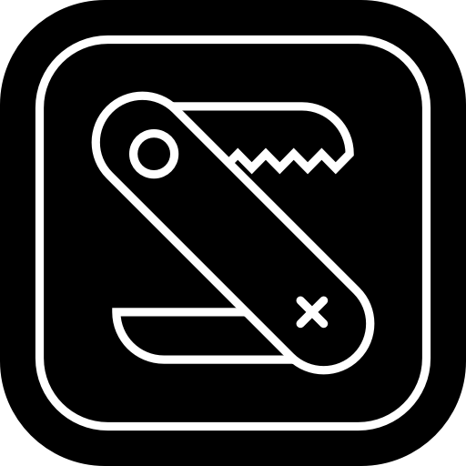

<p align="center">
  
</p>

<h1 align="center">SWS — Swift Window Shell</h1>

<p align="center">
  Lightweight native macOS menu-bar utility belt.<br>
  Press a hotkey, a small floating window opens with the tool you asked for.<br>
  Press it again, it goes away and your focus returns to whatever you were doing.
</p>

<p align="center">
  <a href="https://github.com/merv1n34k/sws/actions/workflows/ci.yml"></a>
  <a href="https://github.com/merv1n34k/sws/releases/latest"></a>
  
  
  
</p>

## Modes

| Mode | Hotkey | What it does |
|---|---|---|
| **Terminal** | ⌥⇧S | Any CLI program (default: `bc -l`). Configure one per command. |
| **Color** | ⌥⇧C | Pixel picker, drag-region palette extractor (Oklab k-means), HEX/RGB/HSL/HSB readouts, WCAG contrast checker. |
| **Time** | ⌥⇧Q | Stopwatch · Countdown · Pomodoro · World clocks · NLP date phrases ("20 hours from now"). |
| **Status** | ⌥⇧D | Pinnable menu-bar widgets for CPU/RAM/SSD/Network + IP, Wi-Fi, ports & HTTP status lookups. |
| **EnDe** | ⌥⇧E | Two-pane converter: Base64 · URL · CSV ↔ Markdown · JWT · QR · Barcode. |
| **Generators** | ⌥⇧X | Password · UUID (v4/v7/ULID) · Lorem ipsum · Random picker. |
| **Clipboard** | ⌥⇧A | Pasteboard history with search, configurable cap, image thumbnails. |
| **OCR** | ⌥⇧R | Drop an image/PDF, get text via Vision. |
| **Scratchpad** | ⌥⇧W | Persistent monospace text. Autosaves. |

All shortcuts are on the left half of the keyboard for one-hand reach.
Mode hotkeys only fire when the window is already open — outside of that
they pass through to whatever app is frontmost.

## Install

```bash
git clone https://github.com/merv1n34k/sws.git
cd sws
make install      # builds SWS.app, copies to /Applications, resets TCC
open /Applications/SWS.app
```

First launch will prompt for **Screen Recording** permission (needed by
the color picker and OCR). Grant it in System Settings → Privacy &
Security → Screen Recording, then quit and reopen.

## Configure

Mode list lives at `~/.config/sws/config.json`. Example:

```json
{
  "version": 2,
  "defaultMode": "calc",
  "modes": [
    { "id": "calc", "type": "terminal",
      "hotkey": { "key": "s", "modifiers": ["shift", "option"] },
      "command": "/usr/bin/bc", "args": ["-l"] },
    { "id": "ende", "type": "ende",
      "hotkey": { "key": "e", "modifiers": ["shift", "option"] } }
  ],
  "fontFamily": "Menlo",
  "fontSize": 14
}
```

Full schema and per-mode options in the
[Configuration guide](docs/guide/configuration.md).

## Requirements

- macOS 13+ (Ventura)
- Apple Silicon or Intel
- Xcode command line tools (`swift`, `codesign`, `iconutil`)

## Documentation

Full guides, per-mode reference, architecture notes, and configuration schema:

**[merv1n34k.github.io/sws](https://merv1n34k.github.io/sws/)**

Or run the site locally:

```bash
make docs    # serves http://localhost:5173 (runs `bun install` on first use)
```

## License

Distributed under MIT licence, see `LICENSE` for more.
